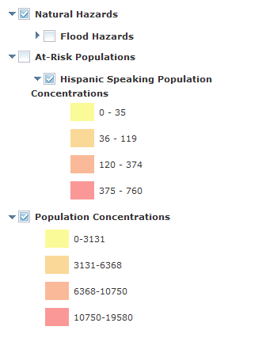

# TOC Legend Widget

## Features
The TOC Legend widget is designed for the ArcGIS Javascript API. It provides a map display table of contents (TOC) and symbology legend that allows the toggling of layer visibility.

[]

## Requirements
* ArcGIS JavaScript API version 3.5 or higher.

## Quickstart

	var map = new Map("mapDiv");
    var imgParams = new ImageParameters();
    imgParams.format = "PNG24";
        var basemap = new DynamicMapService("http://sampleserver1.arcgisonline.com/ArcGIS/rest/services/PublicSafety/PublicSafetyBasemap/MapServer", 
            { id: "base", "imageParameters": imgParams });
        var demomap = new DynamicMapService("http://sampleserver1.arcgisonline.com/ArcGIS/rest/services/PublicSafety/PublicSafetyOperationalLayers/MapServer", 
            { id: "demo1", "imageParameters": imgParams });
    map.addLayers([basemap, demomap]);

    on(map, 'layers-add-result', function () {
        var toc = new TocWidget({
            MapService: demomap,
            MapControl: map,
            Title: "Louisville Public Safety",
            Expand: { options: "all"} 
        }, "tocDiv");
    });

## Install and configure
Download the zip file and extract the contents to your application directory. If you are using a local installation of the JSAPI you can also copy it to your dojo folder.

Example: //localhost/library/jsapi3.7/jsapi/js/dojo/dojo/MyWidgets/TOCLegend/

For more information on using dojoConfig to load custom modules with a CDN, please see the documentation on the Dojo website:
[http://dojotoolkit.org/documentation/tutorials/1.9/cdn/](http://dojotoolkit.org/documentation/tutorials/1.9/cdn/)

Set your dojo config to load the module. The example below shows both options.

	var dojoConfig = {
		packages: [
		{
			name: "APIWidgets",
			//Module loaded from local jsapi/dojo directory:
			location: 'myWidgets/TocWidget'
		}, {
			// The location RegExp below may look confusing but all its doing is 
			// enabling us to load the api from a CDN and load local modules from the correct location.
			name: "AppWidgets",
			//Module loaded from application root directory
			location: location.pathname.replace(/\/[^/]+$/, '') + '/js/TocWidget'
		}]
	};

Add the module for the legend in your dojo require function.

	require(["AppWidgets/TocWidget", "dojo/on",... ], function(TocWidget, on ... ){ ... });

## Load widget
It is important that you load the widget in the proper sequence with the map initialization so that the map service and layers are available to the widget. Always load the widget inside an event handler for the map control's "onLayersAddResult" event. This can be done easily using the dojo/on module.

	map.addLayers([basemap, demomap]);
	on(map, 'layers-add-result', loadTocWidget());

Please note that you if you add just one map service to your map control, you will need to reference the singular event handler for onLayerAddResult:

	map.addLayer(basemap);
	on(map, 'layer-add-result', loadTocWidget());

For more information on event handlers and the ArcGIS API, please visit:
[https://developers.arcgis.com/en/javascript/jshelp/inside_events.html](https://developers.arcgis.com/en/javascript/jshelp/inside_events.html)

## Constructor

#### Map Service vs. Feature Service Layers
The TOC Legend widget has several configuration options which can be managed using the constructor parameters.

The primary distinction is the separate requirements for loading Feature Layers from a Feature Service or loading layers from a standard Map Service (ArcGISDynamicMapServiceLayer).

To load Feature Layers you must create an array of FeatureLayer objects that have been loaded in the map. Additionally, you must set the 'FeatureService' option to true.

	var units = new FeatureLayer(demo4FSurl + "/2", { mode: FeatureLayer.MODE_SNAPSHOT, id: "units", outFields: ["objectid", "echelon"] });
    var opPts = new FeatureLayer(demo4FSurl + "/3", { mode: FeatureLayer.MODE_SNAPSHOT, id: "opPts", outFields: ["objectid", "distance"] });
        
	map.addLayers([basemap, units, opPts]);

	on(map, 'layers-add-result', function () {
		var toc = new TocWidget({
			FeatureService: true,
			FeatureLayers: [units, opPts],
			MapControl: map,
			ShowCheckBoxes: true,
			ToggleAll: true,
			Title: "Military Feature Service"
			Expand: { options: "all" }
		}, "tocDiv");
	});

To load a dynamic map service you must set the 'MapService' property to an instance of a map service object loaded in your map.

	var basemap = new DynamicMapService("http://sampleserver1.arcgisonline.com/ArcGIS/rest/services/PublicSafety/PublicSafetyBasemap/MapServer", 
            { id: "base", "imageParameters": imgParams });
	map.addLayer(basemap);

	on(map, 'layer-add-result', function () {
			var toc = new TocWidget({
			MapService: basemap,
			MapControl: map,
			ShowCheckBoxes: true,
			ToggleAll: false,
			LayersToToggle: [1, 2],
			Title: "My Map",
			className: "customToc",
			Expand: { options: "list", [0,1,2] }
		}, "tocDiv");
	});

### Configuration Options

- MapControl: Required
	+ The esri/map instance in your application.
- MapService: Required for dynamic map services or all legends that do not load Feature Layers.
	+ An instance of a map service object. Can reference the object directly, or use map.getLayer().
	+ Example: MapService: map.getLayer("base")
- FeatureService: Required for Feature Service legends.
	+ boolean
	+ Default is false
	+ set to true for Feature Service legends
- FeatureLayers: Required for Feature Service legends.
	+ array of FeatureLayer objects
- Expand: Required. Applies to grouped layers as well as layers with multiple symbols. If the map service has many layers and large groups, sometimes it is preferable to load the Legend with these items collapsed.
	+ object
	+ { options: string, expandLayers: array }
	+ options: must be set to "none", "all", or "list"
		* "all" : All items are expanded on load.
		* "none" : All items are collapsed on load.
		* "list" : Only layers specified by 'expandLayers' will be expanded, all others are collapsed.
	+ If options is set to "list", you must provide an array of numeric layer IDs using the expandLayers property.
- ShowCheckBoxes: Optional
	+ Default is true
	+ boolean
	+ Legend can be configured with or without checkboxes. If false, no layers with have a checkbox control.
- ToggleAll: Default is true
	+ If true, all items will have a checkbox control for toggling layer display on the map.
	+ If false, the 'LayersToToggle' property must be set.
- LayersToToggle: Optional, required if 'ToggleAll' is false.
	+ array
	+ List numeric layer IDs each layer that should have a checkbox control.
	+ Useful for some maps where you may not want users to turn off certain layers.
- HideLayersList: Optional
	+ array
	+ List numeric layer IDs for any layers that you do not wish to include in the legend.
	+ Note: You do not need to set this property when loading Feature Layers since only layers in the FeatureLayers array will be loaded in the legend.
- Title: Optional
	+ string
	+ Use this to show a title for your legend. 
	+ Default is no title. 
- className: Optional
	+ string
	+ Use this for custom styling of the legend.

## CSS Classes

Custom styles can be applied to the legend using CSS classes. You can modify select elements using the classes below, or you can apply a class name to the dom node of the widget. This property can be set using the "className" property in the widget constructor. Use this class in your own style sheet to apply your own custom styles.

	TocTitle
	TOCFeatureNode
	TOCFeatureLyrNode
	TOCLabelNode
	TOCSymbolNode
	TOCsymbolParentNode
	TOCsubLayerList
	TOCMultiSwatch
	TOCswatch
	TOClayerLabel
	TOCfeatSymbol
	TOCsymbolList
	TOCsubLabel
	TOCswatchLabel
	TOCItemDisabled

PLEASE NOTE:
You must add a link to the dojo claro theme css file in your html page in order to obtain the
fancy dijit checkbox styles in the legend.

    <link rel="stylesheet" href="http://js.arcgis.com/3.7/js/dojo/dijit/themes/claro/claro.css" type="text/css" />

## Known Limitations

* Does not support Image Services
* Does not support more than two levels of nested group layers. This structure is supported:
	+ Parent Group
		- Child Group
			- Subchild layers
			- Subchild layers
* This structure is not supported:
	+ Parent Group
		- Child Group
			- Subchild Group
				- More layers
				- More layers
* This widget is not optimized for use on mobile devices and has not been tested for mobile deployment, mainly due to the fact that most mobile mapping apps do not include a legend.

## Resources

* [ArcGIS for JavaScript API Resource Center](http://help.arcgis.com/en/webapi/javascript/arcgis/index.html)
* [Dojo documentation](http://dojotoolkit.org/documentation/)

